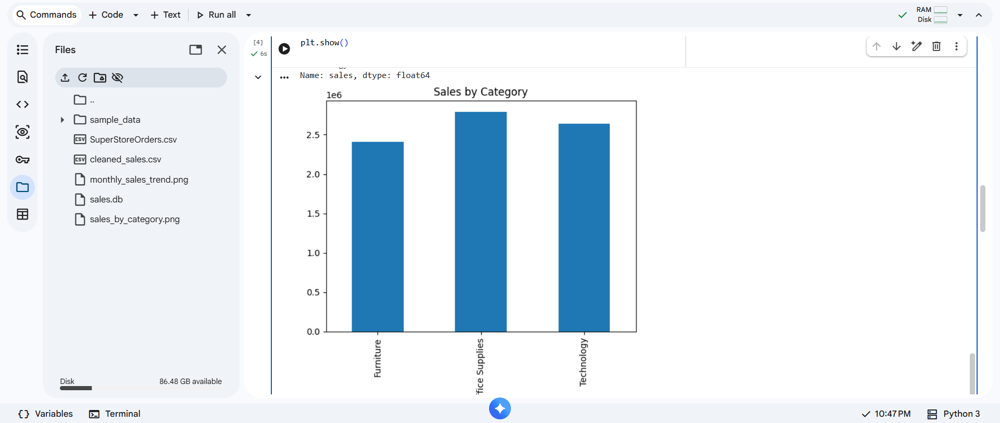
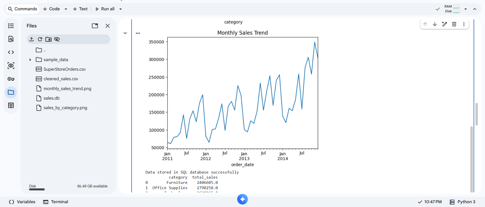
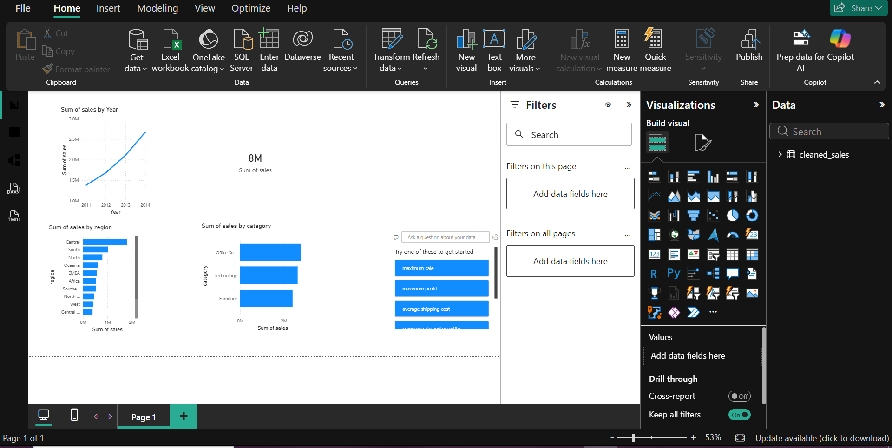

# Retail Sales Analytics and Prediction System

## Overview
This project analyzes retail sales data to identify trends, category-wise performance, and business insights. The workflow includes data cleaning and analysis using Python, storing and querying data using SQL, building a basic machine learning model, and creating a dashboard in Power BI for visualization.

## Tools Used
- Python (Pandas, Matplotlib, Scikit-learn)
- SQL 
- Machine Learning
- Power BI
- Google Colab 

## Steps Performed
- Loaded and cleaned the dataset using Python
- Converted data types and handled missing values
- Performed exploratory data analysis and created visualizations
- Stored cleaned data in SQL database and executed queries
- Built a machine learning model for analysis
- Created an interactive Power BI dashboard

## Results

### Sales by Category

### Monthly Sales Trend

### Power BI Dashboard

